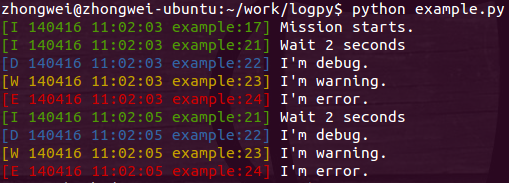

rlog - log module for humans 
============================

We use logging everyday, bug it's easy to forget how to use buildin 
logging module of Python, because the configuration looks complicated. 

So I copy log.py module from [Tornado(github)](https://github.com/facebook/tornado>)

How to use
----------
    
    from rlog import log
    
    log.info("Mission starts.")

Then we will see logging in console and log file under directory /data/logs/

So easy! 

